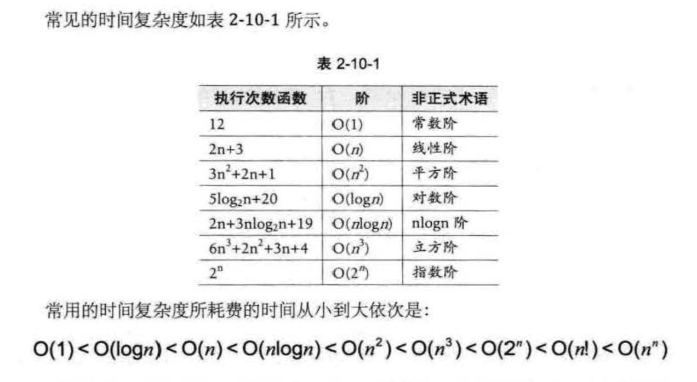

## 算法时间复杂度
### 定义
> 在进行算法分析时，语句总的执行次数
T(n)是关于问题规模n的函数，进而分析T(n)
随n 的变化情况并确定 T(n) 的数量级
。算法的时间复杂度，也就是算法的时间量度，
记作:T(n)=O(f(n))。它表示随问题规模n 的
增大，算法执行时间的增长率和f(n)的
增长率相同，称作算法的渐进时间复杂度，简称为时间
复杂度。其中 f(n) 是问题规模n 的某个函数
**O()称为大O记法**
### 推导大O阶方法
1. 用常数1取代运行时间中的所有加法常数
2. 在修改后的运行次数函数中，只保留最高阶项
3. 如果最高阶项存在且不是1，则去除与这个项相乘的常数
得到的结果就是大 O 阶
### 常数阶
> O(1)
### 线性阶
> 分析算法的复杂度，关键是要分析循环结构的运行情况
eg:
```
for(i=0;i<n;i++) O(n)
```
### 对数阶
> eg:
```
while(count<n)
{
    count=count*2
}
2^x=n x=log2n
O(logn)
```
### 平方阶
>eg:
```
for(i=0;i<n;i++){
    for(j=0;j<n;j++){
        
    }
}
``` 
O(n^2)
### 常见的时间复杂度


