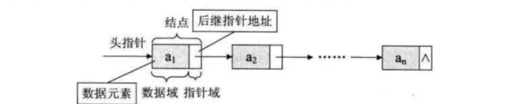
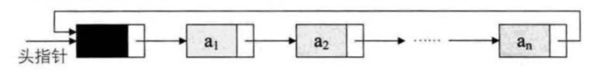
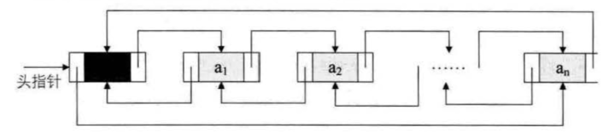

## 线性表的链式存储结构

### 单链表
> n 个结点(a1 的存储映像) 链结成一个链表,即为线性表(a1,a2,...,an) 的链表存储结构
因为此链表的每个结点中只包含一个指针域，所以叫做单链表

> 线性表的单链表生成及操作方式请参看 [单链表demo](demo/List_table_chain_storage_structure_single.js)

### 循环链表

> 将单链表中终端结点的指针端由空指针改为指向头结点，就使整个单链表形成一个环，这种头尾
相接的单链表称为单循环链表，简称循环链表(circular linked list)

> 线性表的循环链表生成及操作方式请参看 [循环链表demo](demo/List_table_chain_storage_structure_circule.js)

### 双向链表

> 双向链表(double linked list)是在单链表的每个结点中，再设置一个指向其前驱结点的指针域

> 线性表的双向链表生成及操作方式请参看 [双向链表demo](demo/List_table_chain_storage_structure_double.js)
